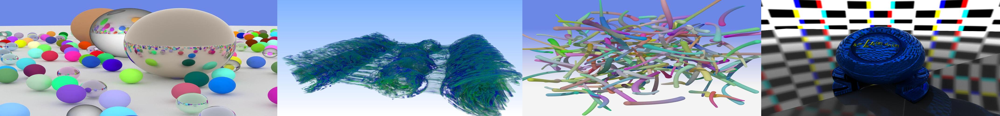
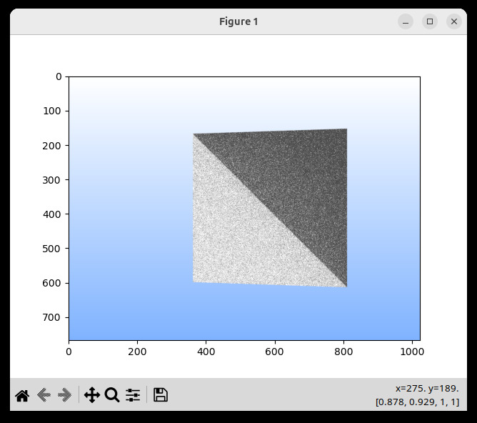
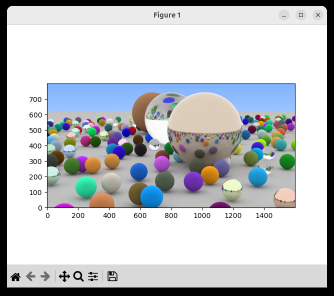
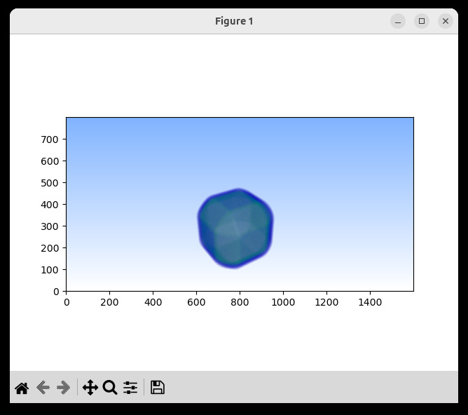
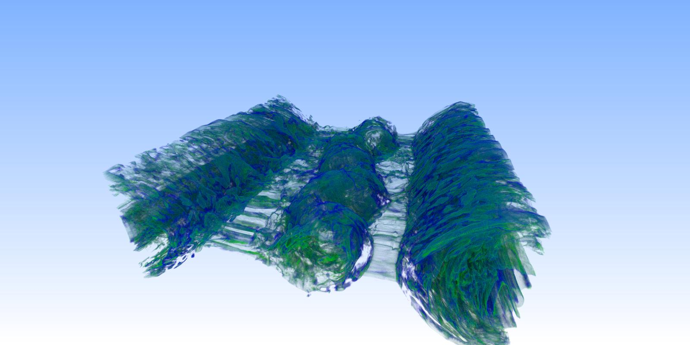
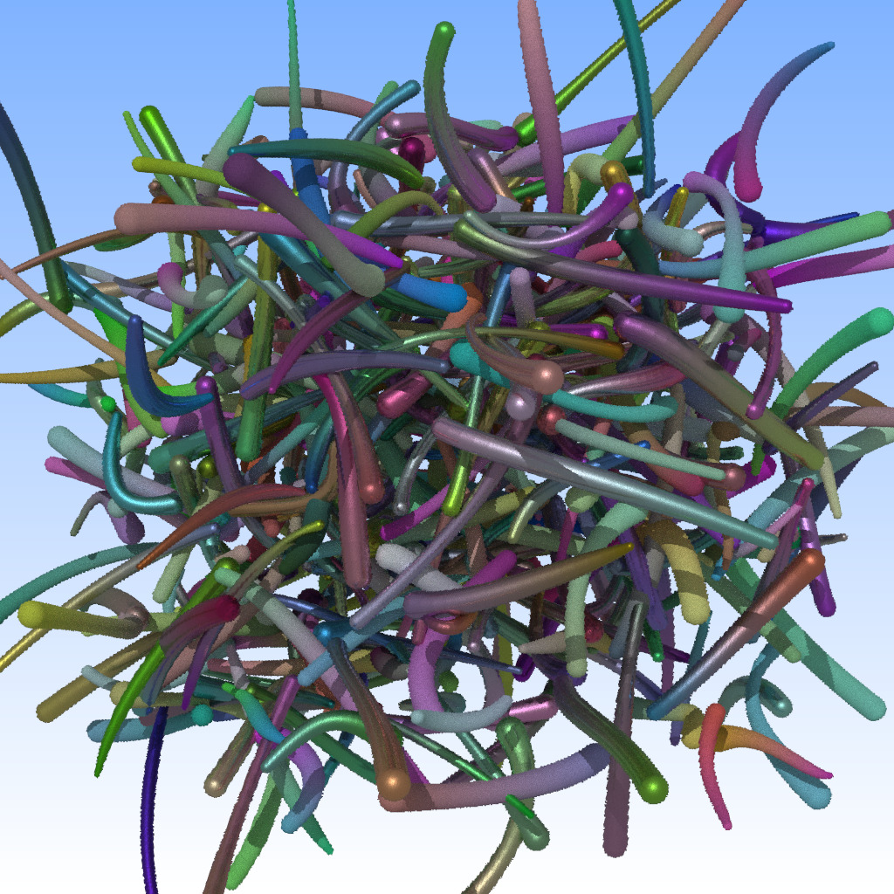
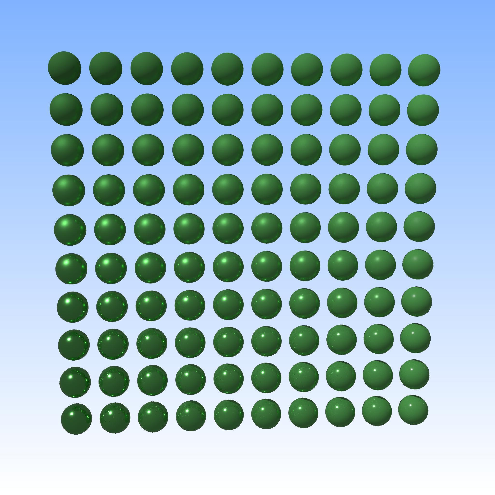
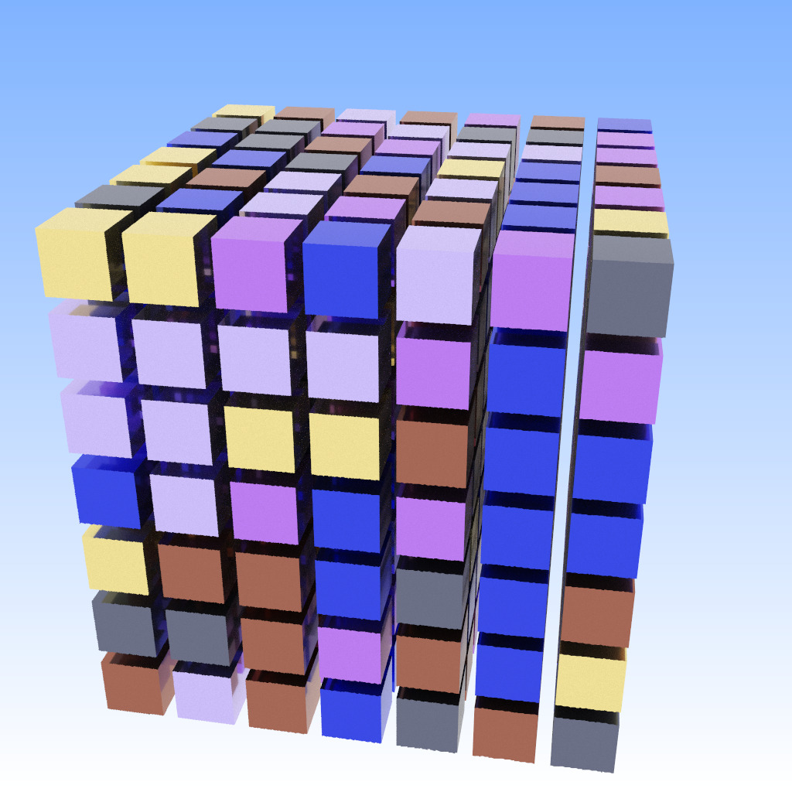

# `pyNARI` - a Python Interface for ANARI



PyNari is a thin python wrapper over the Khronos `ANARI` API
(https://registry.khronos.org/ANARI/) that allows to use ANARI
functionality directly from python program.

Pynari has a 1:1 mapping between ANARI and pynari types and
functionality, with just minor changes to make the API more "pythonic"
(eg, functions that operate on actual objects are python *methods* on
those objects), as well as a bit more consice and readable.

For a more complete example see, e.g.,
https://github.com/ingowald/pynari/blob/master/sample01.py , but in
short, the syntax is about like this:

```
import pynari as anari
import numpy as np
 
device = anari.newDevice('default')

camera = device.newCamera('perspective')
camera.setParameter('position',anari.FLOAT32_VEC3, [0.,0.,0.f])
...
mesh = device.newGeometry('triangle')
vertex = np.array([
  -1.0, -1.0, 3.0,
  -1.0,  1.0, 3.0,
   1.0, -1.0, 3.0,
   0.1,  0.1, 0.3
], dtype = np.float32)
array = device.newArray(anari.FLOAT32_VEC3,vertex)
mesh.setParameter('vertex.position', anari.ARRAY, array)
...
frame = device.newFrame()
...
frame.render()
...
# returns a numpy array of [width,height,4] of np.float32
color_buffer = frame.get('channel.color')
```


# PyNARI equivalents of ANARI Data Types

## Low-level types

ANARI has a lot of data types of the form `ANARI_FLOAT32`,
`ANARI_FLOAT32_VEC3`, `ANARI_ARRAY1D`, etc. In `pynari`, any such type
`ANARI_SOMETHING` is expressed as `anari.SOMETHING; i.e.,
`ANARI_FLOAT32_VEC3` becomes `anari.FLOAT32_VEC3`. Additionally, for
typical scalar/vector types we also allow numpi or CUDA style naming,
i.e., instead of `anari.FLOAT32_VEC3` you can also use `anari.float3`.


## Scalar and Vector types

ANARI Vector types can be expressed as either python lists, or python
tuples, or numpy arrays. Eg, all of the following are valid:

- `matte.setParameter('color',anari.float3,(.5,.5,.5))`
- `matte.setParameter('color',anari.float3,[.5,.5,.5])`
- `matte.setParameter('color',nm.array([.5,.5,.5],dtype=np.float32)`

## Array types

For all *numerical* array types (ie, arrays of scalars, or arrays of
vector types) we use numpy arrays of the underlying scalar types:

```
vertex = np.array([
  -1.0, -1.0, 3.0,
  -1.0,  1.0, 3.0,
   1.0, -1.0, 3.0,
   0.1,  0.1, 0.3
], dtype = np.float32)
array = device.newArray(anari.FLOAT32_VEC3,vertex)
```

Note that arrays of vector types and arrays of scalar types will
automatically convert; e.g., in the example just given a array of 12
floats is implicitly the same as a array of 4 float3 vectors.

FOr all arrays of ANARI object types (e.g., an array of lights, an
array of surfaces, etc, simply use a python list:

```
world.setParameterArray('surface', anari.SURFACE, [ surface ])
```

# PyNARI equivalents of ANARI API Functions

In anari, API functions are C99 style functions, but almost always
 called "on" either a specific ANARI device (e.g.,
 `anariNewRenderer(device,..)`, `anariNewLight(device,...)`, etc), or
 on a specific ANARI object that was previously created (e.g.,
 `anariCommitParameters(device,object)`,
 `anariSetParameter(device,object,...)`, etc.
 
 In pynari, we use a more pythonic/object-oriented way and instead map
 each such function to a method on either a device, or an
 object. I.e., functions that operate on a device become methods of
 that device:
 
 - `anariNewRenderer(device,..)` becomes `device.newRenderer(...)`
 - `anariNewLight(device,..)` becomes `device.newLight(...)`
 - ...
 
 Similarly, methods that operate on a given object become methods
 of that object:

- `anariCommitParameters(device,object,...))` becomes `object.commitParameters(...)`
- `anariSetParameter(device,object,...))` becomes `object.setParameter(...)`
- `anariRenderFrame(device,frame)` becomes `frame.renderFrame()`
- ...

# Biggest Differences to the ANARI C API

As described above, almost all functions in the ANARI C API have very
clear and direct equivalents in `pynari`, and only change in syntax.

There are, however, a few cases where we decided to slightly simplify
some of the more low-level concepts of the ANARI API.

## Device Creation

In ANARI, device creation is a slightly involved operation, also
requires the loading of libraries. etc.

In pynari we decided to simplify that to a simple `device =
anari.newDevice('libName')`, where `libName` is the name of the ANARI
library to be loaded for creating this device. In particular,
`anari.newDevice('default')` will simply use the system's default
ANARI library and create a device from that. Note that `default` will
still respect the `ANARI_LIBRARY` environment variable to specify
which library to use.

## Rendering and Frame Buffer mapping

ANARI allows for asynchronous frame rendering, and thus requires to
both 'start' and 'wait for' frames to finish. In `pynari`, this gets
simplified to simply calling `frame.render()`, which renders a frame
and waits for completion. 

Once a frame is rendered, ANARI allows for "mapping" the resulting
buffers, and processing them as plain C99 arrays/pointers. In pynari,
we instead return the frame buffer contents as numpi arrays of the
specific types. In particular:

- a frame buffer of format `anari.FLOAT32_VEC4` will be returned as
 `np.array` of shape `width,height,4` and type `np.float32`.

- a frame buffer of format `anari.UFIXED8_VEC4` will be returned as
 `np.array` of shape `width,height,1` and type `np.int32`.

- a depth buffer of format `anari.FLOAT32` will be returned as
 `np.array` of shape `width,height,1` and type `np.float32`.

Frame buffers do not get mapped and thus do not require unmapping,
either.  Different channels are read using
`frame.get('channel.color')` and `frame.get('channel.depth')`.


# Building, Installing, and Running

Eventually pynari should be installable through pip, but it's not yet
in a state to do so. Until then:

- To *build*: first download, build, and install the official ANARI
  SDK. Once the SDK is installed this project should build out of the
  box with `cmake`, without additional dependencies. Once built, you
  should have a library of name 
  `pynari.cpython-312-x86_64-linux-gnu.so` (or similar for other
  OS'es)

- To *install*: once built with cmake, do a `make install`. If you
  can't install system-wise, make sure yo have a `PYTHONPATH` variable
  point to where the just built library resides.
  
- TO *run*: Well, python ... `python3 whatEverFile.py`, python will
  load the library as needed. If running into trouble about python not
  finding pynari, check your PYTHONPATH.

# Samples

`pynari` currently comes with a few simple samples to test and
demonstrate capabilities. Note that what actual images get rendered
will depend very much on what actual ANARI implementation you're going
to use - the ANARI API only describes *how* a world is specified, it
doesn't guarantee that all backends will render that in exactly the
same way. For the below screenshots I have used `barney/(B)ANARI`;
other backends may result in different results.

## Sample 1: A simple (bent) quad made of two triangles

https://github.com/ingowald/pynari/blob/master/sample01.py

Mainly tests that 'triangles' geometry exists, and that backend can
create/set Camera, World, and render a Frame.



## Sample 2: A python version of Pete Shirley's "Ray Tracing in One Weekend" Scene

https://github.com/ingowald/pynari/blob/master/sample02.py

Mainly added for fun (and as tribute to Pete's work!), but also very
useful in testing different material configurations for the ANARI
`pysicallyBased` material (Glass, Metal, Lambertian), and whether the
renderer can actually handle such effects. Also useful to test ANARI
`sphere` geometry.



# Sample 3: A tiny structured volume

https://github.com/ingowald/pynari/blob/master/sample03.py

Mainly added to test structured volume data based volume rendering.
In order to avoid any dependencies on external data files the created
volume is tiny (just a 5x5x5 brick of 0/1 voxels), but it does set up
both `transferFunction1D` volume and `structuredRegular` spatial
field. If the renderer can handle those, it can probably also handle
larger data.



If you do happen to have a copy of the "magnetic" volume data set
lying around in your current working dir, you can also run
`sample03.py -m` to get this:




# Sample 4: ANARI 'curves' geometry

https://github.com/ingowald/pynari/blob/master/sample04.py

Added to test 'curves' with per-vertex radius. Creates a set of
different cubic curves, approximates them with linear (per-vertex)
curve segments, and creates appropriate ANARI 'curve' geometry.




# Sample 5: MPI Data-Parallel ANARI Example 

https://github.com/ingowald/pynari/blob/master/sample05.py

Simple "materials-test" setup with grid of spheres that use a PBR material,
with roughness and metallicness varying across those spheres.




# Sample 6: ANARI PBR material test grid

https://github.com/ingowald/pynari/blob/master/sample06.py

MPI-Data Parallel Rendering test. Requires to be started with MPI, and
to use a "Data Parallel ANARI" capable ANARI device (such as 
`barney` or `ptc`). Here an example of running with 6 ranks
using barney

```
mpirun -x ANARI_LIBRARY=barney -n 6 python3 ../sample06.py  -o sample06.png
```



